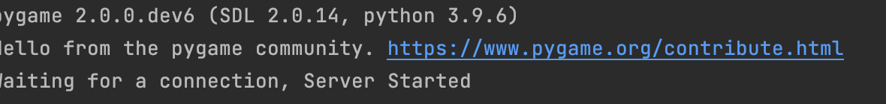

# Online-multiplayer-game

A program in python that runs a server and  renders a window consisting of a rectangular objects indicatng positions of different clients . The rectangular objects move within the window in response to keys pressed by their clients.These changes are reflected in the other client's windows.

# Instructions on executing the game

<ol>
  <li> Make sure you are in the top level of directory
  
  <li> To install the requird packages type
    
```
pip -r requirenments.txt    
```

    
<li> On line 8 of network.py replace the text in between the quotes with your machines's IP address. Do the same on line 7 on file server.py
  
  
  <li>Now execute the script used to start the server using the following command
    
```
    
    python3 server.py
```
    
Expect the following on the console window

    
 <li> 
  
 Open a new tab in your terminal to run the client script with the command
  
  ```
  python3 client.py
  ```
  You should see a square located on the top left corner of the pygame client window as follows
  
  
